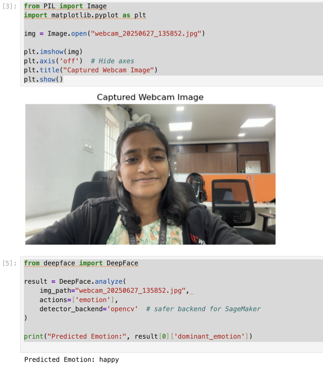
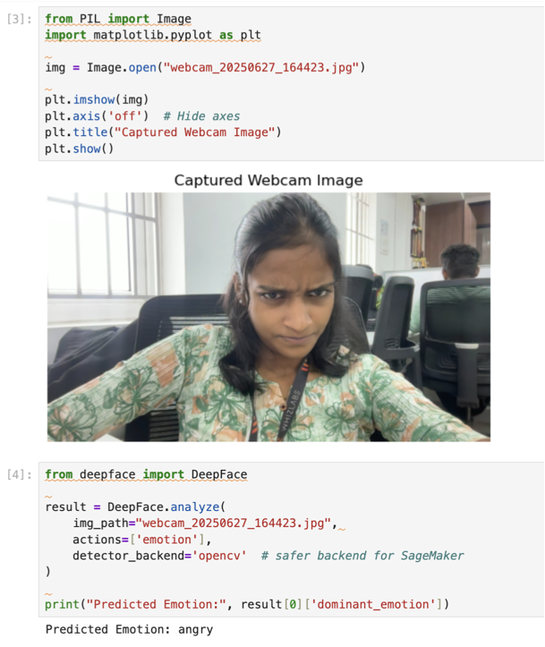
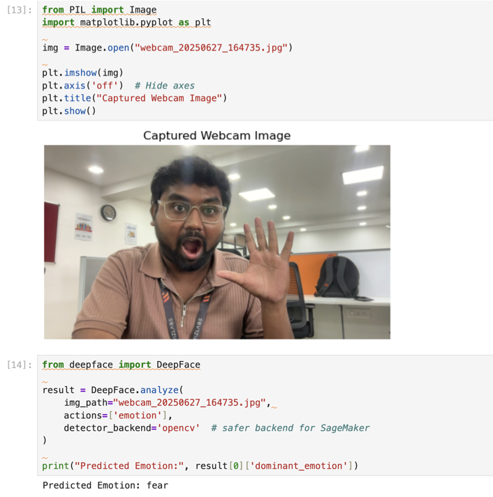
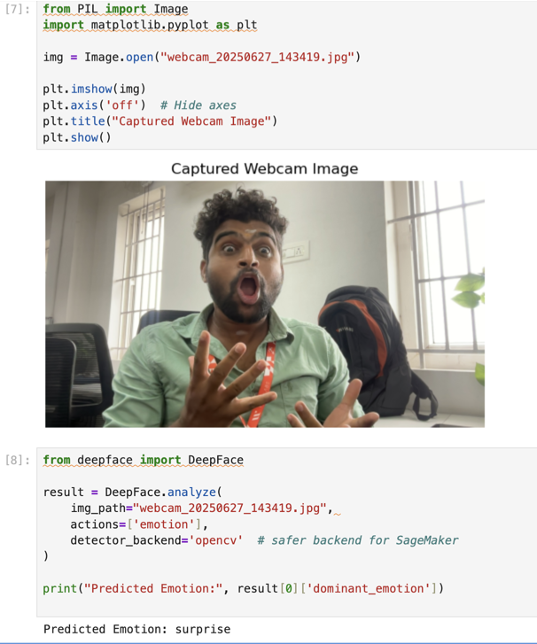

# 🎓 DeepFace Emotion Detection Lab

A beginner-friendly AI project that detects **emotion** and **gender** from webcam images using `DeepFace`, `OpenCV`, and `Amazon SageMaker`. The entire pipeline is cloud-based and ideal for AWS Free Tier users.

---

## ✨ What This Project Does

- 📷 Captures image from webcam via terminal script  
- ☁️ Uploads the image to **Amazon S3**  
- 🧠 Analyzes image in **SageMaker Jupyter Notebook** using DeepFace  
- 🚹 Detects Emotion & Gender using lightweight OpenCV backend  
- 🪶 Uses minimal resources – perfect for students & beginners

---

## 🧰 Tech Stack

- 🐍 **Python**  
- 🧠 **DeepFace**  
- 🖼️ **OpenCV (headless)**  
- ☁️ **Amazon S3**  
- 🔬 **Amazon SageMaker**  
- 💻 **GitHub**

---

## 🚀 How to Use

1. Run `upload_image_to_s3.py` to capture and upload image to S3  
2. Launch your Jupyter Notebook inside SageMaker  
3. Run DeepFace analysis with `emotion` and `gender` actions  
4. View your predictions right inside the notebook!

---

## 🖼️ Emotion Detection Samples

### 😊 Happy

---

### 😠 Angry

---

### 😱 Fear

---

### 😲 Surprise

---

## 🐞 Problems Faced

- ⚠️ SageMaker kernel restarted when using heavy models (like `age`)  
- ⚠️ Face not detected in blurry or low-light images  
- ⚠️ Git push failed due to divergence & rebase conflicts  
- ⚠️ Needed to reduce backend load using `opencv`

---

## 🌟 Why This Project is Unique

- ☁️ Built 100% in the cloud using AWS Free Tier  
- 🎯 Combines facial analysis, cloud storage, and serverless compute  
- 🧪 Easy to follow, yet production-scalable with minor tweaks  
- 🧩 Offers visual proof of performance via live screenshots

---

## 🧠 What I Learned

- 🧬 Real-time facial analysis with DeepFace  
- 🛠️ Python + AWS integration (S3 & SageMaker)  
- 🔄 Resolving Git conflicts and managing remote workflows  
- ⚙️ Efficient resource usage in a cloud notebook environment

---

## 🔮 Future Enhancements

- ➕ Age and Race detection (with memory optimization)  
- 🔁 Auto-analyze via S3 trigger using AWS Lambda  
- 🖥️ Build a UI to live-stream and detect emotions  
- 🐳 Containerize and deploy using Fargate or Lambda

---

## 🌟 credits: 
  👤 Zehra Stark  
  💡 Developer, Creator, and Documenter of this lab  
  💻 Project: DeepFace Emotion Detection Lab  
  🌐 Repository: github.com/zehra-stark/deepface-emotion-lab

---

## 📁 GitHub Repo

🔗 [**deepface-emotion-lab**](https://github.com/zehra-stark/deepface-emotion-lab)

---

> _“Power isn’t determined by your size, but by the size of your dream and how far you’re willing to go to protect it.👒🪬”_

---
